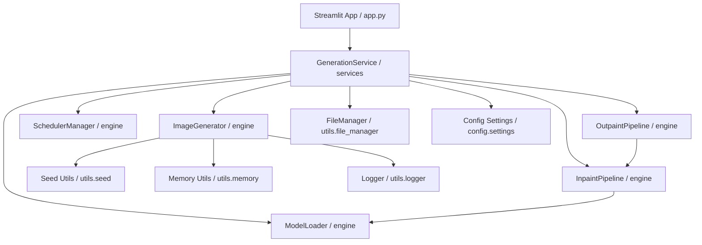

# CanvasGen Architecture Documentation

This document describes the high-level architecture, module breakdown, and data flow of the **CanvasGen** AI Image Generation platform.

---

## 1. System Overview

CanvasGen is designed following **SOLID** principles, modular architecture, and layered separation of concerns. The platform decouples machine learning pipeline loading, image synthesis execution, hardware resource management, and user interfaces.

---

## 2. Core Modules & Component Responsibilities

### 2.1 Configuration Layer (`config/`)
- **`settings.py`**: Centralized configuration powered by `pydantic-settings.BaseSettings`. Loads variables from `.env` with fallback default values and type validation.

### 2.2 Core Engine Layer (`engine/`)
- **`loader.py` (`ModelLoader`)**: Manages model checkpoint loading from HuggingFace Hub or local cache, handles device allocation (`cuda`, `cpu`), floating point precision (`fp16`, `fp32`), and HF authentication tokens.
- **`generator.py` (`ImageGenerator`)**: Orchestrates Text-to-Image synthesis and multi-image batch generation with seed sequence tracking.
- **`scheduler.py` (`SchedulerManager`)**: Manages noise sampler selection (DPM-Solver++, Euler Discrete, DDIM, LMS) and multi-scheduler quality comparisons.
- **`inpaint.py` (`InpaintPipeline`)**: Handles masked region image replacement and mask format validation.
- **`outpaint.py` (`OutpaintPipeline`)**: Manages directional canvas padding expansion and mask creation for seamless background extensions.

### 2.3 Service Layer (`services/`)
- **`generation_service.py` (`GenerationService`)**: Unified facade encapsulating engine loaders, generators, and file persistence for UI and API endpoints.

### 2.4 Utility Layer (`utils/`)
- **`image.py`**: PIL Image resizing, aspect ratio math, grid composition, Base64 conversion.
- **`memory.py`**: PyTorch CUDA VRAM cleanup (`torch.cuda.empty_cache()`) and system RAM diagnostic tools.
- **`seed.py`**: Global deterministic seed setter for `random`, `numpy`, and `torch`.
- **`logger.py`**: Structured logging configuration with file and console appenders.
- **`file_manager.py`**: Safe timestamped filename generation and directory creation.

---

## 3. Data Flow Execution

1. **User Request**: User interacts with `app.py` UI or invokes `GenerationService`.
2. **Configuration Validation**: `Settings` validates target dimensions, CFG scale, and step bounds.
3. **Seed Enforcement**: `utils.seed.set_seed()` sets random state across standard libraries.
4. **Pipeline Retrieval**: `ModelLoader` yields active PyTorch / Diffusers pipeline instance.
5. **Generation**: `ImageGenerator` executes denoising loop.
6. **Artifact Output & Cleanup**: Generated PIL image is formatted by `utils.file_manager`, saved to `outputs/`, and `utils.memory.flush_vram()` releases unreferenced CUDA tensors.
