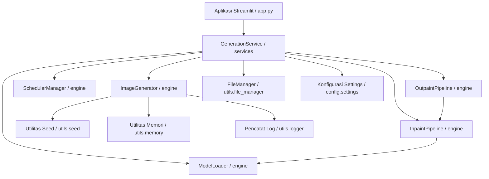

# Dokumentasi Arsitektur CanvasGen

Dokumen ini menjelaskan arsitektur tingkat tinggi, rincian modul, dan alur data dari platform Generasi Gambar AI **CanvasGen**.

---

## 1. Gambaran Umum Sistem

CanvasGen dirancang mengikuti prinsip **SOLID**, arsitektur modular, dan pemisahan tanggung jawab berlapis. Platform ini memisahkan pemuatan pipeline machine learning, eksekusi sintesis gambar, manajemen sumber daya hardware, dan antarmuka pengguna.

---

## 2. Modul Utama & Tanggung Jawab Komponen

### 2.1 Lapisan Konfigurasi (`config/`)
- **`settings.py`**: Konfigurasi terpusat ditenagai oleh `pydantic-settings.BaseSettings` / `dataclass`. Memuat variabel dari `.env` dengan nilai default fallback dan validasi tipe data.

### 2.2 Lapisan Engine Utama (`engine/`)
- **`loader.py` (`ModelLoader`)**: Mengelola pemuatan checkpoint model dari HuggingFace Hub atau cache lokal, menangani alokasi perangkat (`cuda`, `cpu`), presisi floating point (`fp16`, `fp32`), dan token autentikasi HF.
- **`generator.py` (`ImageGenerator`)**: Mengorkestrasi sintesis Text-to-Image dan generasi batch multi-gambar dengan pelacakan urutan seed deterministik.
- **`scheduler.py` (`SchedulerManager`)**: Mengelola pemilihan noise sampler (DPM-Solver++, Euler Discrete, DDIM, LMS) dan pengujian perbandingan kualitas multi-scheduler.
- **`inpaint.py` (`InpaintPipeline`)**: Menangani penggantian area gambar bermasker dan validasi format mask.
- **`outpaint.py` (`OutpaintPipeline`)**: Menangani perluasan padding kanvas dan pembuatan mask untuk perpanjangan latar belakang secara mulus.

### 2.3 Lapisan Layanan (`services/`)
- **`generation_service.py` (`GenerationService`)**: Fasad terpadu yang membungkus loader engine, generator, dan penyimpanan file untuk antarmuka pengguna dan API.

### 2.4 Lapisan Utilitas (`utils/`)
- **`image.py`**: Resizing gambar PIL, matematika rasio aspek, penyusunan grid gambar, konversi Base64.
- **`memory.py`**: Pembersihan VRAM PyTorch CUDA (`torch.cuda.empty_cache()`) dan alat diagnosa RAM sistem.
- **`seed.py`**: Pengatur seed deterministik global untuk `random`, `numpy`, dan `torch`.
- **`logger.py`**: Konfigurasi pencatatan log terstruktur dengan pencatat konsol dan file.
- **`file_manager.py`**: Pembuatan nama file berstempel waktu dan manajemen direktori secara aman.

---

## 3. Alur Eksekusi Data

1. **Permintaan Pengguna**: Pengguna berinteraksi dengan UI `app.py` atau memanggil `GenerationService`.
2. **Validasi Konfigurasi**: `Settings` memvalidasi dimensi target, skala CFG, dan batas langkah iterasi.
3. **Penerapan Seed**: `utils.seed.set_seed()` menetapkan status acak pada seluruh pustaka standar.
4. **Pengambilan Pipeline**: `ModelLoader` menyerahkan instance pipeline PyTorch / Diffusers yang aktif.
5. **Generasi**: `ImageGenerator` mengeksekusi loop denoiser.
6. **Output Artefak & Pembersihan**: Gambar PIL yang dihasilkan diformat oleh `utils.file_manager`, disimpan ke `outputs/`, dan `utils.memory.flush_vram()` melepaskan tensor CUDA yang tidak lagi direferensikan.
