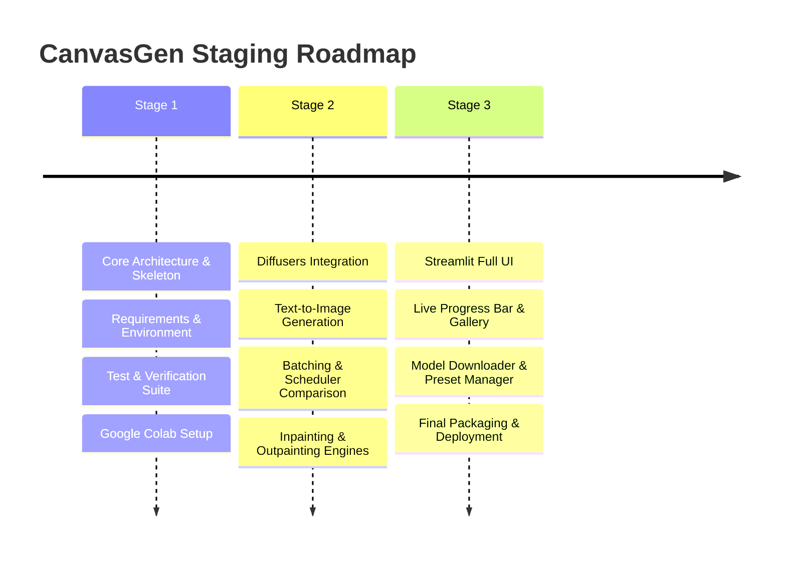

# CanvasGen Git & Staging Workflow

This document outlines the Git branching strategy, contribution guidelines, automated QA integration, and multi-stage development roadmap for **CanvasGen**.

---

## 1. Git Branching Strategy

CanvasGen follows GitFlow branching rules:

- **`main`**: Production stable releases. All commits must be tagged with semver (e.g. `v1.0.0`).
- **`develop`**: Integration branch for upcoming releases and stage milestones.
- **`feature/<feature-name>`**: Dedicated feature branches branched from `develop` (e.g., `feature/inpainting-ui`).
- **`bugfix/<issue-name>`**: Bugfix branches targeting specific issues.

---

## 2. Commit Message Standards

All commits must follow Conventional Commits format:

- `feat: add DPMSolver scheduler support`
- `fix: resolve VRAM memory leak on batch generation`
- `docs: update Architecture.md diagrams`
- `test: add unit test for OutpaintPipeline canvas expansion`

---

## 3. Multi-Stage Development Roadmap

### Stage Transition Readiness Checklist

To transition from Stage 1 to Stage 2:
- [x] All core engine module skeletons defined with PEP8, type hints, and docstrings.
- [x] Unit test suite passing with 100% success rate on imports, directory structure, and smoke tests.
- [x] Settings management loading cleanly from `.env`.
- [x] Google Colab notebook (`colab.ipynb`) created and verified.
