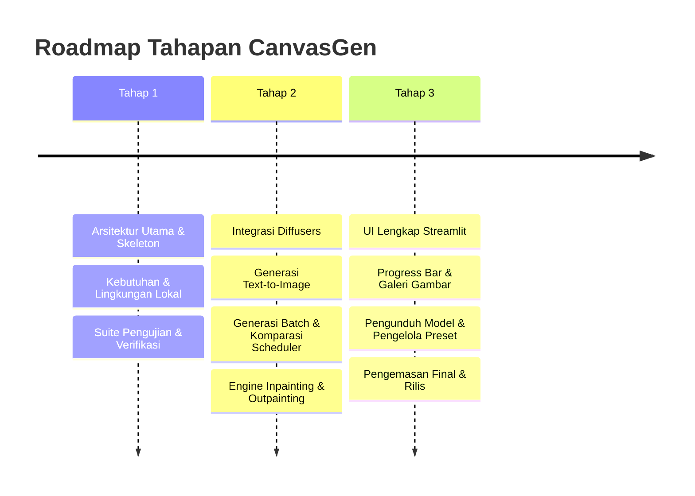

# Alur Kerja Git & Tahapan Staging CanvasGen (Pengembangan 100% Lokal)

Dokumen ini menjelaskan strategi branching Git, panduan kontribusi, integrasi QA otomatis, dan roadmap pengembangan multi-tahap untuk **CanvasGen**.

---

## 1. Strategi Branching Git

CanvasGen mengikuti alur kerja branching GitFlow:

- **`main`**: Rilis stabil produksi. Seluruh commit harus diberi tag versi semver (misalnya `v1.0.0`).
- **`develop`**: Branch integrasi untuk rilis mendatang dan pencapaian milestone tahap.
- **`feature/<nama-fitur>`**: Branch fitur khusus yang dibuat dari `develop` (misalnya `feature/inpainting-ui`).
- **`bugfix/<nama-masalah>`**: Branch perbaikan bug yang menargetkan masalah tertentu.

---

## 2. Standar Pesan Commit

Seluruh commit wajib mengikuti format Conventional Commits:

- `feat: add DPMSolver scheduler support`
- `fix: resolve VRAM memory leak on batch generation`
- `docs: update Architecture.md diagrams`
- `test: add unit test for OutpaintPipeline canvas expansion`

---

## 3. Roadmap Pengembangan Multi-Tahap

### Daftar Periksa Kesiapan Transisi Tahap

- [x] Tahap 1: Arsitektur utama, skeleton modul, utilitas, dan suite pengujian dasar terverifikasi.
- [x] Tahap 2: Integrasi Diffusers, Text-to-Image, Batching, Scheduler Swapping, Inpainting, Outpainting, dan 19 pengujian unit lulus 100%.
- [ ] Tahap 3: Penyempurnaan antarmuka visual Streamlit UI penuh.
